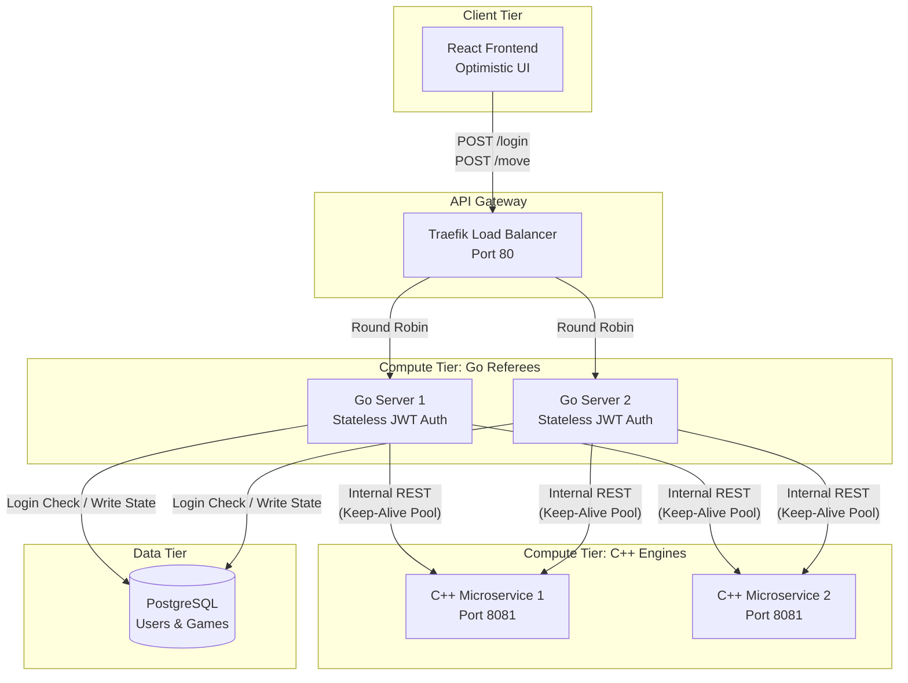

```mermaid
graph TD
    subgraph Client Tier
        UI["React Frontend<br/>Optimistic UI"]
    end

    subgraph API Gateway
        LB["Traefik Load Balancer<br/>Port 80"]
    end

    subgraph Compute Tier: Go Referees
        Go1["Go Server 1<br/>Stateless JWT Auth"]
        Go2["Go Server 2<br/>Stateless JWT Auth"]
    end

    subgraph Compute Tier: C++ Engines
        C1["C++ Microservice 1<br/>Port 8081"]
        C2["C++ Microservice 2<br/>Port 8081"]
    end

    subgraph Data Tier
        DB[("PostgreSQL<br/>Users & Games")]
    end

    %% Public Traffic Flow
    UI -- "POST /login<br/>POST /move" --> LB
    LB -- "Round Robin" --> Go1
    LB -- "Round Robin" --> Go2

    %% Database Interactions
    Go1 -- "Login Check / Write State" --> DB
    Go2 -- "Login Check / Write State" --> DB

    %% Internal Microservice Traffic (The Fix)
    Go1 -- "Internal REST<br/>(Keep-Alive Pool)" --> C1 & C2
    Go2 -- "Internal REST<br/>(Keep-Alive Pool)" --> C1 & C2
```
